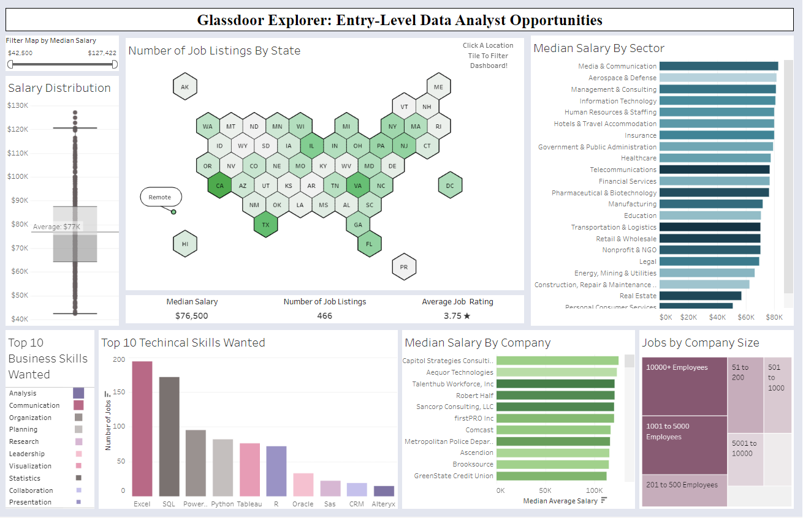
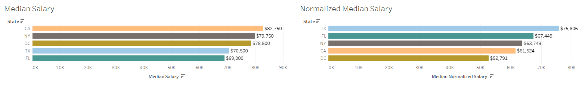

# Unlocking Opportunities: Glassdoor Job Market Analysis
This project is designed to empower entry-level data analysts in today's competitive job market by leveraging web scraping techniques to gather up-to-date job listings from [Glassdoor.com](https://www.glassdoor.com/Job/united-states-data-analyst-jobs-SRCH_IL.0,13_IN1_KO14,26.htm). It offers valuable insights into prime job locations, in-demand skills sought by employers, top-paying sectors, leading companies, as well as comprehensive salary and company-related data analysis.

Tableau Dashboard: [Link](https://public.tableau.com/views/GlassdoorInsights-DataAnalyst/Dashboard1?:language=en-US&:display_count=n&:origin=viz_share_link)
## Data Flow 


## Web Scraping

In the initial phase of this project, job listings from Glassdoor were scraped using ***Python, Selenium, and BeautifulSoup*** libraries to automate the data collection process. Below are the key components of the web scraping process:

- **Selenium**: Selenium was utilized to automate web interactions and navigate through job listings. The Chrome WebDriver was employed for this task.

- **BeautifulSoup**: BeautifulSoup was used to parse HTML content and extract relevant information from the job listings, such as job title, company name, location, salary, sector, rating, job description, and more.

- **Handling Popups**: Popups related to signup/login on Glassdoor were handled to ensure they do not interfere with the scraping process.

- **Pagination**: Pagination logic was implemented to collect a large number of job listings by navigating through multiple pages of job results.

- **Data Storage**: The scraped data was saved into an Excel file for further analysis.

The code for the web scraping process can be found in the ```Glassdoor_Scraper.py``` script.

## Data Cleaning

Once the job listings data was scraped, extensive data cleaning was performed to ensure that the dataset is ready for analysis. Here are the key steps involved in the data cleaning process:

- **Removing Duplicates**: Duplicate job listings based on company name, job title, and location were removed to maintain data integrity.

- **Handling Missing Data**: Rows with missing data were identified and removed to maintain data quality.

- **Standardizing Company Names**: Company names were cleaned by removing extraneous characters, ratings, and other inconsistencies.

- **Parsing Location Data**: The location data was split into city and state, and listings with no specific state were labeled as "Remote."

- **Standardizing Salary Data**: Salary information was cleaned by removing irrelevant text like "Glassdoor or Employer Est" and "Per Hour." Hourly wages were converted to annual salaries for fair comparison.

- **Removing Senior Roles**: Senior job titles were removed to focus on entry-level positions.

**Data Quality Observation**:

The initial scraped dataset, comprising 5579 rows, revealed data quality issues during assessment. After rigorous cleaning, the dataset was refined to 466 high-quality rows, meeting ROCCC standards (Reliability, Objectivity, Completeness, Currency, Consistency).

The cleaned dataset was saved as a CSV file for further analysis. The code for data cleaning can be found in the ```glassdoor_job_cleaning.ipynb``` notebook.

## Textual Analysis 

Textual analysis was performed on the job descriptions in the dataset. This analysis involved several steps:

- **Text Cleaning**: Job descriptions were cleaned by removing non-alphabet characters and converting text to lowercase.

- **Stopword Removal**: Common English stopwords were removed from the job descriptions to focus on meaningful content.

- **Skill Frequency Analysis**: The frequency of technical skills (e.g., Python, SQL, Tableau) and business skills (e.g., communication, leadership) mentioned in job descriptions was identified.

- **Regex Usage**: Regular expressions (regex) were utilized for complex text cleaning tasks, such as salary extraction and job title filtering.

- **Data Narrowing**: The analysis was structured to narrow down the dataset for specific skills, making it easier to visualize skill demand.

## Data Analysis & Visualization

With the cleaned dataset and insights from textual analysis, the data analysis and visualization efforts provide a comprehensive perspective on the job market.

We chose to use median salary instead of the average to mitigate the impact of outliers, resulting in a more accurate representation of salary expectations.

**Interactive Dashboard**

Tableau: [Link](https://public.tableau.com/views/GlassdoorInsights-DataAnalyst/Dashboard1?:language=en-US&:display_count=n&:origin=viz_share_link)


The Tableau dashboard offers a dynamic exploration of the data, accommodating diverse user interests. Here are some key visualizations and their potential interpretations:

- **Number of Job Listings by State**: Easily identify states with abundant job opportunities, aiding location-based job searches.

- **Median Salary by Sector**: Discover sectors with competitive salary offerings, supporting decision-making and negotiation.

- **Top 10 Technical and Business Skills Wanted**: Identify the most sought-after skills in the job market, facilitating skill development and career planning.

- **Salary Distribution**: Explore the distribution of salaries for a comprehensive understanding of the salary landscape.

These visualizations cater to various user priorities, whether it's salary considerations, location preferences, sector analysis, or skill demand assessment. The interactive nature of the dashboard empowers users to derive meaningful insights tailored to their unique needs.

**Example Insight Based on Data Scraped**

1. To stand out, enhance your skills in Excel and SQL, as these are highly sought after by employers. Consider prioritizing projects that prominently feature these skills to make your resume more appealing.

2. Align your projects with sectors like media/communication, defense, or consulting. This strategic focus can lead to better-paying opportunities and industry-specific expertise.

3. Location matters, so concentrate your job search in areas with more job listings, such as California (CA) and Texas (TX), or explore remote work options. By targeting these regions, you increase your chances of securing a job that aligns with your career goals.

Taking these steps can set you on a path to success in the job market and enhance your career prospects.

## Further Analysis Ideas

### Adjusting for Cost of Living

When analyzing salaries, it could help to account for the disparities in the cost of living across different locations. A $75,000 salary in a high-cost city might offer a similar standard of living as a $50,000 salary in a lower-cost area. One way to address this is to normalize salaries based on the [Cost of Living Index (COLI)](https://meric.mo.gov/data/cost-living-data-series) for each state.

**Normalized Salary = (Data Analyst Salary / COLI) * 100**

To implement salary normalization, SQL can be used to integrate the dataset with a table containing state-specific COLI values. Here's an SQL code example for salary normalization:

```sql
SELECT
    glass.*,
    avg_salary / coli.Cost_Of_Living_Index * 100 AS normalized_salary
FROM
    glassdoor_usa glass
JOIN
    state_coli coli
ON
    glass.state = coli.state;
```
**Example:**



However, it's important to be aware of the limitations when using the COL Index for normalization. COLI values are state-level averages and may not capture local variations within cities or regions, potentially oversimplifying the cost-of-living differences. Alternatively, considering factors such as rental prices or creating a customized index that reflects specific spending areas relevant to your circumstances could provide a more nuanced perspective on cost-of-living adjustments.

---
Project By: Amolvir Taunque